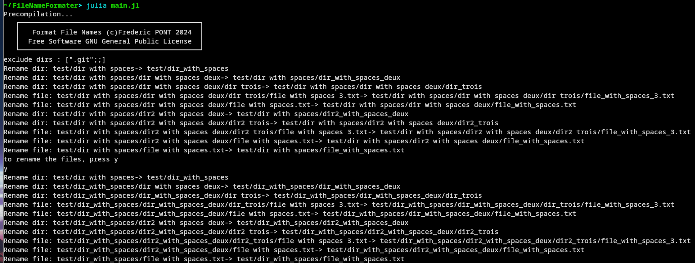

#  File Name Formater
File Name Formater is a software to rename recursively files and folders, removing spaces and special characters.


# Quick start
- install [Julia](https://julialang.org/downloads/)
- open a terminal
- start the software using the syntax :

```
julia main_recursive.jl path/   

# example to analyse the test directory
julia main_recursive.jl test/   
```
```

# ScreenShots

