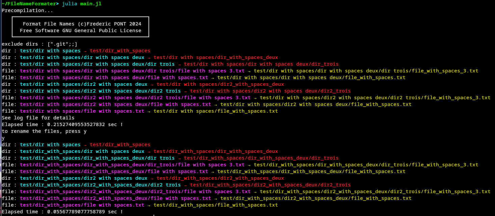

#  File Name Formater
File Name Formater is a software to rename recursively files and folders.

CAUTION there is no recovery possible after file/dir names renaming or truncation.
You use this software at your own risks.

The software does not overwrite a file (`force=false`). It is possible that after renaming a file is identical to a file that already exist. For example if both file `$~myFileName` and `myFileName` exists, the software will not overwrite the file `myFileName` and leave `$~myFileName` unchanged.

# Features
- Rename files (replace spaces, accents, special char...or use custom rules)
- Rename directories (replace spaces, accents, special char...or use custom rules)
- unlimited number of regex patterns for renaming rules
- Truncate the file names
- Truncate the dir names
- Exclude some directories
- log file output
- optional terminal output

# Quick start
- install [Julia](https://julialang.org/downloads/)
- open a terminal
- go to the FileNameFormater directory using "cd" command
- to customise the characters replacement rules, edit the file ```conf/rules.csv ```(TAB seprator)
- to exclude some directories, edit the file ```conf/excludeDirList.csv ``` and enter one directory name (the name only, not the path) per line
- to enable file and/or dir names truncation, edit the file ```conf/conf.json```.


```
path = directory to analyse path
maxFileChar = maximum number of char in file names
cutFileNames : true/false enable/disable file names cutting
maxDirChar = maximum number of char in dir names
cutDirNames : true/false enable/disable dir names cutting
terminalOutput: true/false enable/disable print file/dir names on the terminal
```

```
{
    "path":"test",
    "maxFileChar": 30,
    "cutFileNames": false,
    "maxDirChar": 30,
    "cutDirNames": false,
    "terminalOutput" : false
}

```

- start the software using the syntax :

```
julia main.jl 
```

# ScreenShots

